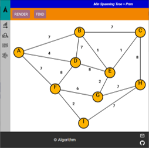

<!--
### Hi there 👋

**eagleduk/eagleduk** is a ✨ _special_ ✨ repository because its `README.md` (this file) appears on your GitHub profile.

Here are some ideas to get you started:

- 🔭 I’m currently working on ...
- 🌱 I’m currently learning ...
- 👯 I’m looking to collaborate on ...
- 🤔 I’m looking for help with ...
- 💬 Ask me about ...
- 📫 How to reach me: ...
- 😄 Pronouns: ...
- ⚡ Fun fact: ...
-->

    <h1 align="center">
        Welcome, I'm SJ.Lee
    </h1>

<!--

    

        ddd
    

    

        ttr
    

 -->

<!-- 

    <table>
        <tr>
            <td>
                <strong>Developer of</strong>
            </td>
            <td>
                <ul>
                    <li>
                        played soccer,
                    </li>
                    <li>
                        slow but do not give up,
                    </li>
                    <li>
                        belive hands and eyes than ears,
                    </li>
                </ul>
            </td>
        </tr>
    </table>

 -->

    <h3 align="center"> 
        Interested Languages, Frameworks
    </h3>

    
    
    
    
    
    
    
    

    

        Side Projects
    

    <table width="100%">
        <tbody>
        <tr>
            <td width="60px" align="center">
                <a href="https://eagleduk.github.io/datastructure/" target="_blank">
                    Data Structure
                </a>
            </td>
            <td align="center">
                
                <!--  -->
            </td>
            <td align="center">
                
                
                
            </td>
            <td width="120px" align="center">
                
            </td>
            <td>
                The operations of basic data structures such as array, queue, stack, linked-list, hash-table, tree, and max-heap are expressed in html, css, and javascript.
            </td>
        </tr>
        <tr>
            <td width="60px" align="center">
                <a href="https://eagleduk.github.io/algorithm/" target="_blank">
                    Algorithm
                </a>
            </td>
            <td align="center">
                
                <!--  -->
            </td>
            <td align="center">
                
                
                
            </td>
            <td width="120px" align="center">
                
            </td>
            <td>
                Expressing the basic operations of sorting (bubble, selection, insertion), search (sequential, binary, depth-first, breadth-first), SPP (dijkstra), and MST (kruskal, prim) algorithms in html, css, and javascript.
            </td>
        </tr>
        <tr>
            <td width="60px" align="center">
                <a href="https://eagleduk.github.io/Tranining_Tactics/" target="_blank">
                    Traning Tactics
                </a>
            </td>
            <td align="center">
                
                <!--  -->
            </td>
            <td align="center">
                
                
            </td>
            <td width="120px" align="center">
                
            </td>
            <td>
                Tactical board for positioning and role playing. Step-by-step confirmation is possible with the snapshot and playback functions. Mobile-based design allows you to check anytime, anywhere.
            </td>
        </tr>
            <!-- <tr>
                <td width="33%" align="center">
                    Data Structure
                </td>
                <td width="33%" align="center">
                    Algorithm
                </td>
                <td width="33%" align="center"> 
                    Traning_Tactics
                </td>
            </tr>
            <tr>
                <td align="center">
                    
                </td>
                <td align="center">
                    
                </td>
                <td align="center">
                    
                </td>
            </tr>
            <tr>
                <td align="center">
                    
                    
                    
                </td>
                <td align="center">
                    
                    
                    
                </td>
                <td align="center">
                    
                    
                </td>
            </tr>
            <tr>
                <td align="center">
                    
                </td>
                <td align="center">
                    
                </td>
                <td align="center">
                    
                </td>
            </tr> -->
        </tbody>
    </table>

    

        Study Project
        <!-- <h2> Study Project </h2> -->
    

    <table width="100%">
        <tr>
            <td width="250" align="left">
                kakao-clone
            </td>
            <td>
                
                
                
                
            </td>
            <td width="150">
                
            </td>
        </tr>
        <tr>
            <td width="250" align="left">
                youtube-clone
            </td>
            <td>
                
                
                
                
                
                
                
            </td>
            <td width="150">
                
            </td>
        </tr>
        <tr>
            <td width="250" align="left">
                realtimeNodeJS
            </td>
            <td>
                
                
                
                
            </td>
            <td width="150">
                
            </td>
        </tr>
        <tr>
            <td width="250" align="left">
                netflix-clone
            </td>
            <td>
                
                
            </td>
            <td width="150">
                
            </td>
        </tr>
        <tr>
            <td width="250" align="left">
                instagram-clone(backend)
            </td>
            <td>
                
                
                
                
                
                
                
                
            </td>
            <td width="150">
                
            </td>
        </tr>
        <tr>
            <td width="250" align="left">
                instagram-clone(frontend)
            </td>
            <td>
                
                
                
            </td>
            <td width="150">
                
            </td>
        </tr>
        <tr>
            <td width="250" align="left">
                Music Video Player
            </td>
            <td>
                
                
            </td>
            <td width="150">
                
            </td>
        </tr>
    </table>

    

        Notes
        <!-- <h2> Notes </h2> -->
    

    

        
        
        
        
        
        
        
    

    

        Certificate
        <!-- <h2> Certificate </h2> -->
    

    <table>
        <tr>    
            <td width="400" align="left">
                프론트엔드 개발 올인원 패키지 with React Online
            </td>
            <td>
                
                <!--  -->
            </td>
            <td>
                <!--  -->
            </td>
        </tr>
        <tr>    
            <td width="400" align="left">
                100일 코딩 챌린지 - Web Development 부트캠프
            </td>
            <td>
                
            </td>
            <td>
                
            </td>
        </tr>
        <tr>    
            <td width="400" align="left">
                Typescript :기초부터 실천형 프로젝트까지 with React + NodeJS
            </td>
            <td>
                
            </td>
            <td>
                
            </td>
        </tr>
        <tr>    
            <td width="400" align="left">
                React Query : React로 서버 상태 관리하기
            </td>
            <td>
                
            </td>
            <td>
                
            </td>
        </tr>
        <tr>    
            <td width="400" align="left">
                JavaScript 알고리즘 & 자료구조 마스터 클래스
            </td>
            <td>
                
            </td>
            <td>
                
            </td>
        </tr>
        <tr>    
            <td width="400" align="left">
                TypeScript 마스터 with Webpack & React
            </td>
            <td>
                
            </td>
            <td>
                
            </td>
        </tr>
        <tr>    
            <td width="400" align="left">
                React 완벽 가이드 with Redux, Next.js, TypeScript 강의
            </td>
            <td>
                
            </td>
            <td>
                
            </td>
        </tr>
    </table>

    
    

    
    
    

    

